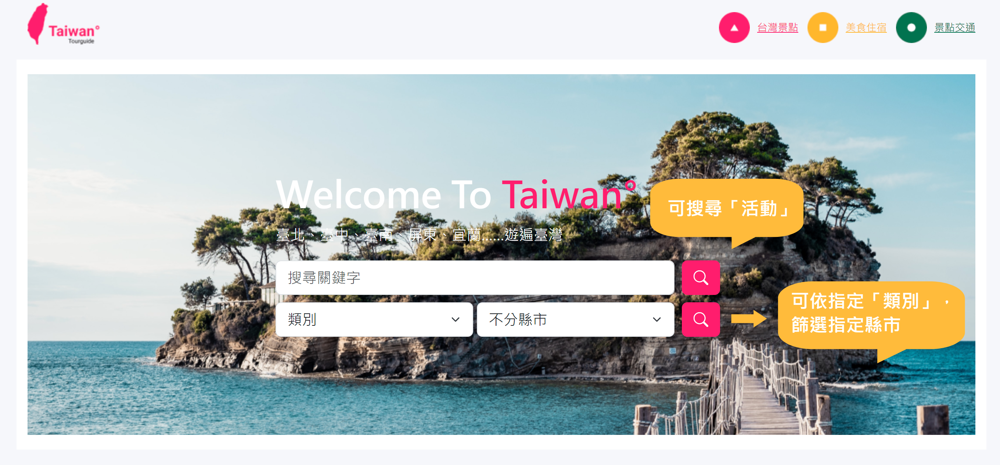
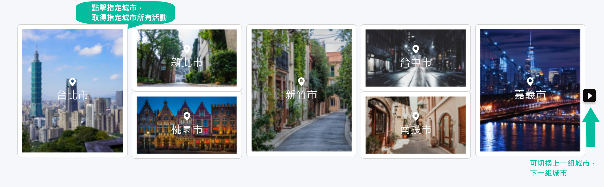
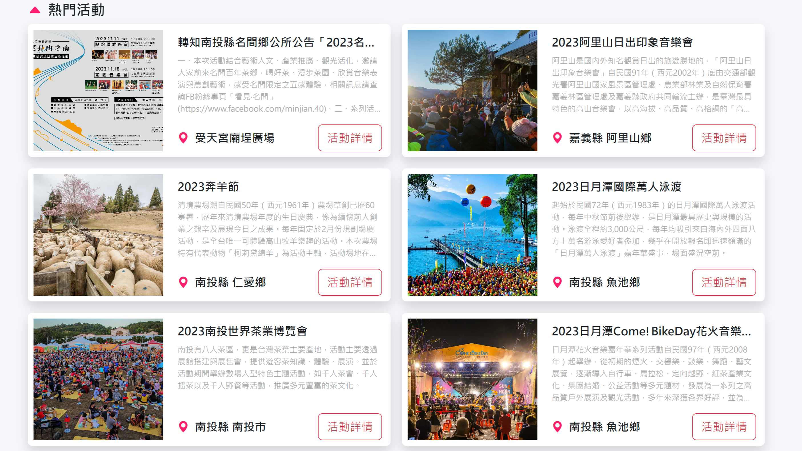
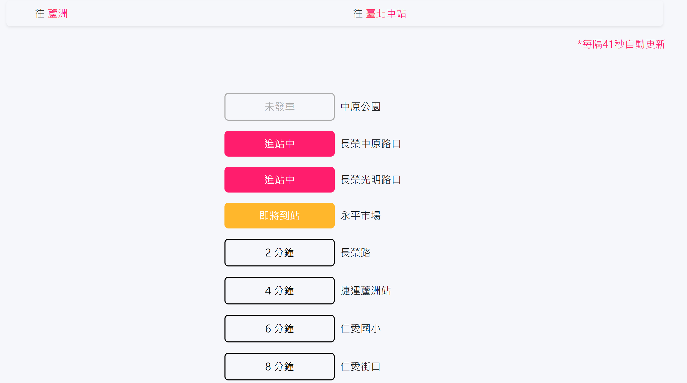

# 台灣觀光旅遊網

<h1>Introduction</h1>

使用Vue3 Composition API(Setup語法糖) + Vite 製作專案，
  並串接<strong>交通部TDX API</strong>，進而取得活動、景點、美食、住宿、公車動向資料，
  可使用「搜尋」、「下拉選單」取得對應資料。

<h1>技術</h1>
<h3>網頁切版</h3>
<ul>
  <li>HTML 5</li>
  <li>CSS</li>
  <li>SCSS</li>
  <li>Bootstrap 5</li>
  <li>RWD響應式</li>
</ul>
<h3>前端開發、前端框架</h3>
<ul>
  <li>Vite建置專案</li>
  <li>Vue3 + JavaScript ES6 資料處裡與渲染</li>
  <li>Pinia 狀態管理</li>
  <li>Vue Router 路由切換</li>

</ul>
<h3>第三方套件</h3>
<ul>
  <li>Axios 網路請求</li>
  <li>loading-overlay 加載動畫</li>
</ul>

<h1>搜尋功能</h1>
<ol>
  <li>於首頁時，透過關鍵字可搜尋「活動」</li>
  <li>於美食住宿時，透過關鍵字可搜尋「美食」</li>
  <li>於首頁時，透過下拉選單，篩選指定「類別」+「指定縣市」</li>
  <li>於美食住宿時，透過下拉選單，篩選指定「類別」+「指定縣市」</li>
</ol>

<h1>城市活動</h1>
<ol>
  <li>滑入背景圖，圖片放大</li>
  <li>按鈕可切換下一組城市、上一組城市</li>
  <li>點擊城市背景圖，取得該城市所有活動</li>
</ol>

<h1>搜尋結果</h1>
<ol>
  <li>以卡片方式呈現</li>
  <li>點擊後，以Modal方式彈出詳細資訊</li>
  <li>點擊按鈕可切換圖片</li>
</ol>

<h1>公車動態搜尋</h1>
<ol>
  <li>每60秒更新動態</li>
  <li>需先選擇「指定縣市」，才會撈到「指定縣市所有公車」</li>
  <li>粉色代表「已進站」，橘色代表「即將進站」，黑色字體代表「剩餘X分鐘」，灰色代表「未發車」</li>
</ol>

<h1>參考資料</h1>

交通部 <a href="https://tdx.transportdata.tw/">TDX 運輸資料流通服務</a>

